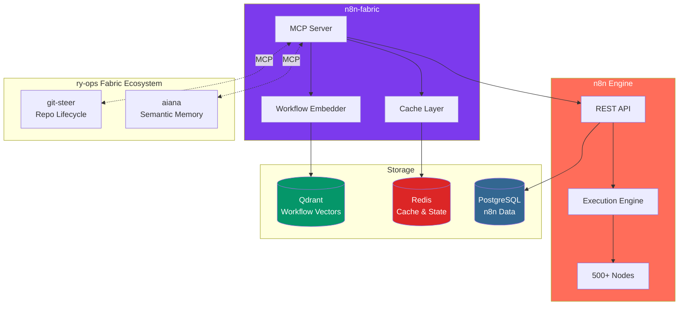
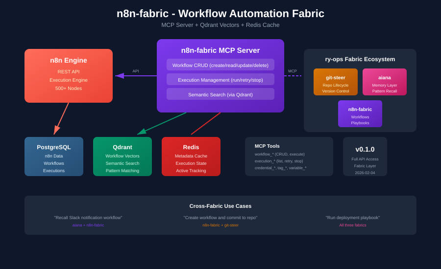

# n8n-fabric

**Workflow Automation Fabric Layer**

n8n-fabric wraps n8n with an MCP server, Qdrant vector storage, and Redis caching—making workflows searchable, memorable, and orchestratable alongside git-steer and aiana.

## Architecture



<p align="center">
  
</p>

---

## Features

### MCP Server
- **Full n8n API access** - Workflows, executions, credentials, nodes
- **Semantic search** - Find workflows by meaning, not just name
- **Cross-fabric coordination** - Works with git-steer and aiana

### Workflow Intelligence
- **Vector embeddings** - Workflows stored in Qdrant for similarity search
- **Pattern recognition** - "How did I handle webhook → transform → API?"
- **Playbook recall** - Find and reuse proven workflow patterns

### Infrastructure
- **Docker Compose** - One command to run full stack
- **Redis caching** - Fast workflow metadata and execution state
- **PostgreSQL** - n8n's persistent storage

---

## Quick Start

### Docker Compose (Recommended)

```bash
# Clone repository
git clone https://github.com/ry-ops/n8n-fabric
cd n8n-fabric

# Start full stack (n8n + Qdrant + Redis + PostgreSQL)
docker compose up -d

# Check status
docker compose ps

# View n8n UI
open http://localhost:5678
```

### Local Development

```bash
# Install dependencies
uv sync

# Set environment variables
export N8N_URL=http://localhost:5678
export N8N_API_KEY=your-api-key

# Run MCP server
uv run n8n-fabric-mcp
```

---

## MCP Tools

### Workflow Management

| Tool | Description |
|------|-------------|
| `workflow_list` | List all workflows with metadata |
| `workflow_get` | Get workflow by ID (full JSON) |
| `workflow_create` | Create new workflow from JSON |
| `workflow_update` | Update existing workflow |
| `workflow_delete` | Delete workflow |
| `workflow_activate` | Activate workflow |
| `workflow_deactivate` | Deactivate workflow |
| `workflow_execute` | Execute workflow manually |
| `workflow_search` | Semantic search across workflows |

### Execution Management

| Tool | Description |
|------|-------------|
| `execution_list` | List executions with filters |
| `execution_get` | Get execution details and data |
| `execution_delete` | Delete execution |
| `execution_retry` | Retry failed execution |
| `execution_stop` | Stop running execution |

### Credentials & Nodes

| Tool | Description |
|------|-------------|
| `credential_list` | List credential names (no secrets) |
| `credential_create` | Create new credential |
| `credential_delete` | Delete credential |
| `node_types` | List available node types |
| `node_info` | Get node type details |

### System & Status

| Tool | Description |
|------|-------------|
| `n8n_status` | n8n health and version |
| `fabric_status` | Full stack health check |
| `fabric_sync` | Sync workflows to Qdrant |

---

## Configuration

### Environment Variables

| Variable | Description | Default |
|----------|-------------|---------|
| `N8N_URL` | n8n API URL | `http://localhost:5678` |
| `N8N_API_KEY` | n8n API key | (required) |
| `QDRANT_URL` | Qdrant URL | `http://localhost:6343` |
| `REDIS_URL` | Redis URL | `redis://localhost:6389` |
| `N8N_ENCRYPTION_KEY` | n8n encryption key | (required for production) |

> **Note:** Ports 6343 and 6389 are used to avoid conflicts with existing Qdrant/Redis instances.

### Claude Desktop Integration

```json
{
  "mcpServers": {
    "n8n-fabric": {
      "command": "uv",
      "args": ["run", "n8n-fabric-mcp"],
      "cwd": "/path/to/n8n-fabric"
    }
  }
}
```

---

## Fabric Ecosystem

n8n-fabric is part of the ry-ops fabric ecosystem:

| Fabric | Role | MCP Tools |
|--------|------|-----------|
| **n8n-fabric** | Workflow execution, playbooks | Workflows, executions, credentials |
| **git-steer** | Repo lifecycle, version control | Repos, branches, security, PRs |
| **aiana** | Semantic memory, pattern recall | Memory search, context injection |

### Cross-Fabric Examples

```
"Remember how I built the Slack notification workflow"
  → aiana searches memory
  → n8n-fabric retrieves workflow
  → Returns full workflow JSON

"Create a new webhook-to-Slack workflow and commit it"
  → n8n-fabric creates workflow
  → git-steer commits workflow JSON to repo
  → aiana indexes for future recall

"Run my deployment notification playbook"
  → aiana recalls playbook pattern
  → n8n-fabric executes workflow
  → git-steer logs deployment
```

---

## Documentation

- [CLAUDE.md](CLAUDE.md) - AI assistant context
- [Architecture](docs/ARCHITECTURE.md) - Technical design
- [ADR-001](docs/decisions/001-fabric-architecture.md) - Fabric design decisions

---

## License

MIT License - see [LICENSE](LICENSE) file for details.

---

**Repository:** [github.com/ry-ops/n8n-fabric](https://github.com/ry-ops/n8n-fabric)

**Status:** Alpha - Initial Development

**Version:** 0.1.0

**Updated:** 2026-02-04
