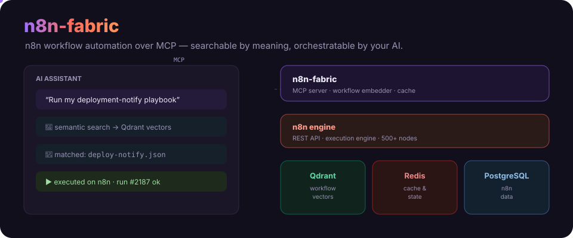
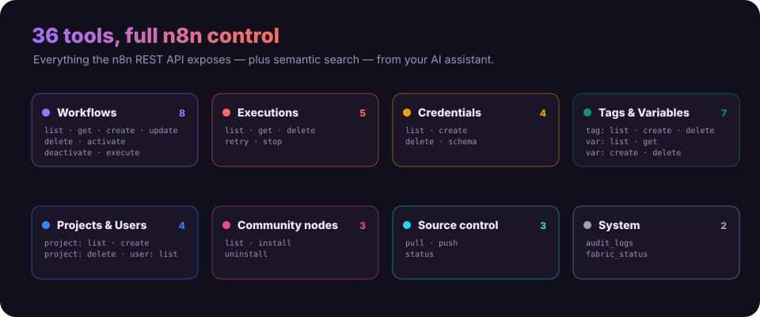

<p align="center">
  
</p>

<h1 align="center">n8n-fabric</h1>

<p align="center"><b>n8n workflow automation, over MCP.</b> A fabric layer that wraps n8n with an MCP server, Qdrant vector storage and Redis caching — so your workflows are searchable by meaning, memorable, and orchestratable by your AI assistant alongside <a href="https://github.com/ry-ops/git-steer">git-steer</a> and aiana.</p>

<p align="center">
  
  
  
  
  <a href="LICENSE"></a>
</p>

---

## What it does

n8n has 500+ nodes and a full REST API, but it lives behind a UI. n8n-fabric puts it behind **MCP** instead, so an AI assistant can list, build, run and manage workflows in plain language. Every workflow is also embedded into **Qdrant**, so you can find one by *what it does* — *"how did I handle webhook → transform → API?"* — not just by name. **Redis** caches metadata and execution state; **PostgreSQL** is n8n's own store.

## The 36 tools

<p align="center">
  
</p>

| Group | Tools |
|---|---|
| **Workflows** | `workflow_list` · `_get` · `_create` · `_update` · `_delete` · `_activate` · `_deactivate` · `_execute` |
| **Executions** | `execution_list` · `_get` · `_delete` · `_retry` · `_stop` |
| **Credentials** | `credential_list` · `_create` · `_delete` · `_schema` |
| **Tags & Variables** | `tag_list` · `_create` · `_delete` · `variable_list` · `_get` · `_create` · `_delete` |
| **Projects & Users** | `project_list` · `_create` · `_delete` · `user_list` |
| **Community nodes** | `community_node_list` · `_install` · `_uninstall` |
| **Source control** | `source_control_pull` · `_push` · `_status` |
| **System** | `audit_logs` · `fabric_status` |

## Quick start

```bash
git clone https://github.com/ry-ops/n8n-fabric
cd n8n-fabric

# full stack: n8n + Qdrant + Redis + PostgreSQL
docker compose up -d
docker compose ps

open http://localhost:5678   # n8n UI
```

**Run the MCP server from source** (Python 3.11+, [uv](https://docs.astral.sh/uv/)):

```bash
uv sync
export N8N_URL=http://localhost:5678
export N8N_API_KEY=your-api-key
uv run n8n-fabric-mcp
```

**Connect Claude Desktop** — add to `claude_desktop_config.json`:

```json
{
  "mcpServers": {
    "n8n-fabric": {
      "command": "uv",
      "args": ["run", "n8n-fabric-mcp"],
      "cwd": "/path/to/n8n-fabric"
    }
  }
}
```

Then ask: *"List my active workflows,"* *"Create a webhook → Slack workflow and activate it,"* or *"Find the workflow that posts deploy notifications and run it."*

## Configuration

| Variable | Description | Default |
|---|---|---|
| `N8N_URL` | n8n API URL | `http://localhost:5678` |
| `N8N_API_KEY` | n8n API key | *(required)* |
| `QDRANT_URL` | Qdrant URL | `http://localhost:6343` |
| `REDIS_URL` | Redis URL | `redis://localhost:6389` |
| `N8N_ENCRYPTION_KEY` | n8n encryption key | *(required for production)* |

> Ports `6343` / `6389` are used to avoid clashing with any existing Qdrant/Redis instances.

## Part of the ry-ops fabric

n8n-fabric is one layer of a larger fabric, each exposed over MCP:

| Fabric | Role |
|---|---|
| **n8n-fabric** | workflow execution & playbooks |
| **[git-steer](https://github.com/ry-ops/git-steer)** | repo lifecycle, security, PRs |
| **aiana** | semantic memory & pattern recall |

Together they close the loop: *"Create a webhook-to-Slack workflow and commit it"* → n8n-fabric builds it, git-steer commits the JSON, aiana indexes it for next time.

## Documentation

- [CLAUDE.md](CLAUDE.md) — AI assistant context
- [Fabric coordination](docs/FABRIC_COORDINATION.md) — wiring n8n-fabric, git-steer and aiana together
- [ADR-001](docs/decisions/001-fabric-architecture.md) — fabric design decisions

## License

MIT. See [LICENSE](LICENSE).

<!-- org-footer -->
---

<p align="center"><sub>Part of <a href="https://github.com/ry-ops">ry-ops</a> · building the pipes between infrastructure, automation, and observability · built by <a href="https://github.com/ry-ops">ry-ops</a></sub></p>
